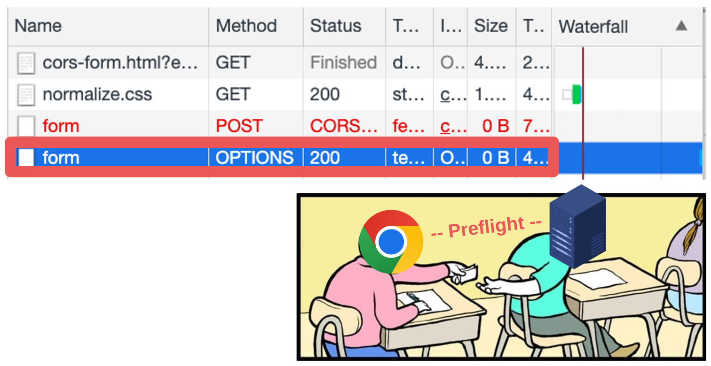
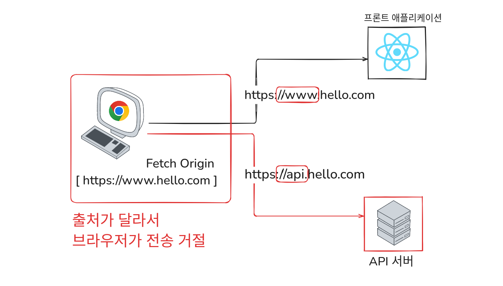
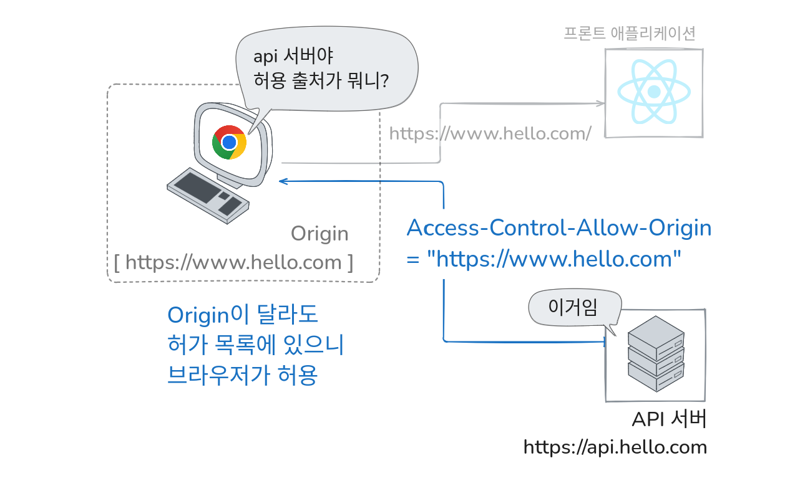
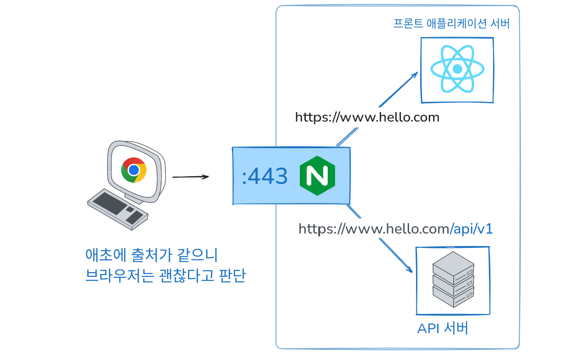
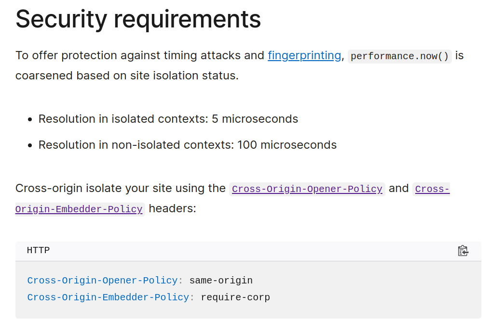

이번 시간에는 브라우저 보안 정책에 대해 이야기해보겠습니다.

브라우저 보안 정책은 언제 처음 도입 되었을까요?

이는 1995년 Netscape 2.02. 버전에서 등장한 보안 정책, Same Origin Policy 에서 부터 시작됩니다.

<!--more-->

## ◼️ Same Origin Policy

넷스케이프 네비게이터


출처 : [https://en.wikipedia.org/wiki/Netscape_Navigator_2](https://en.wikipedia.org/wiki/Netscape_Navigator_2)

1995년, 넷프케이프 네비게이터 브라우저에 새로운 스크립트 언어가 추가되었습니다.

동적으로 브라우저의 DOM에 접근하고, 내용을 수정할 수 있는 **자바스크립트**의 등장입니다.


출처 : [https://ko.wikipedia.org/wiki/자바스크립트](https://ko.wikipedia.org/wiki/%EC%9E%90%EB%B0%94%EC%8A%A4%ED%81%AC%EB%A6%BD%ED%8A%B8)

당시 자바스크립트는 막강했습니다.

서로 다른 브라우저 탭에 저장된 쿠키를 획득할 수 있었고, 다른 DOM 객체에도 접근할 수 있었습니다.

예를 들면, 넷스케이프 2.0 브라우저는 자바스크립트 프로그램이 `about:cache`  url을 통해 클라이언트의 모든 브라우저 히스토리 목록에 접근할 수 있습니다.

- ⚠️ Can one javascript domain access another’s DOM?  **YES**
- ⚠️ Can one site access data from another site? **YES**
- ⚠️ Can one site send data to another site’s server? **YES**

이러한 기능을 막고자 1995년, 넷스케이프 2.02 버전에 하나의 보안책이 추가되었습니다.

바로 `Same Origin Policy`입니다.


출처 : [http://ftp.lanet.lv/ftp/windows/www/netscape2.02/](http://ftp.lanet.lv/ftp/windows/www/netscape2.02/)

> **JavaScript Security**
>
>
> ---
>
> Navigator version 2.02 and later automatically prevents scripts on one server from accessing properties of documents on a different server. This restriction prevents scripts from fetching private information such as directory structures or user session history.
>
> 출처 : [http://rilievo.stereofot.it/teledidattica/javascript/jsref/intro.ht](http://rilievo.stereofot.it/teledidattica/javascript/jsref/intro.htm)
>

Same Origin Policy 하에 모든 자바스크립트 요청의 출처는 동일해야 합니다.

여기서 ***같은 출처***의 기준은 뭘까요?


참고 : [Google I/O Web.dev](https://web.dev/articles/same-site-same-origin?hl=ko)

브라우저는 프로토콜, 호스트 네임, 포트까지 동일한 웹사이트를 ‘동일 출처’ 로 간주됩니다.

예를 들어, URL이 `https://www.example.com:443/foo/bar` 이면 '출처'는 `https://www.example.com:443` 입니다.

## ◼️ CORS Policy

시간이 흘러 브라우저 시장에서 MS의 인터넷 익스플로러가 주도권을 잡게 되었고, `XmlHttpRequest API`가 등장했습니다.

`XmlHttpRequest API`로 인해 브라우저는 페이지 로딩이 끝난 이후 동적으로 서버에 HTTP 요청을 할 수 있게 되었죠.

그러나 이는 `동일 출처 정책 (SOP)` 의 제한이 발생합니다. 따라서 교차 출처 허용 표준이 없던 시절엔, 이 문제를 우회적으로 해결해야 했습니다.

이후 2006년 5월 17일에 W3C는 access-control 명세 초안을 발표하여 크로스 도메인 이슈를 해결하는 표준을 만들기 위한 논의를 시작했는데, 이게 현재의 [CORS 정책](https://en.wikipedia.org/wiki/Cross-origin_resource_sharing)이 되었습니다.

> **“권한이 있다면, 출처가 달라도 접근 가능하도록 하자”**


이는 서버가 허용한 교차 출처 목록이 없다는 의미입니다.

브라우저가 `OPTION` 으로 보낸 `Preflight` 요청으로 인해 발생한 CORS 정책 위반 메시지입니다.



브라우저가 본 요청에 앞서 보내는 OPTION 요청이 preflight 요청입니다.


만약 출처도 다르고(Origin) 교차 출처 허용(CORS)도 없다면, `fetch` 요청시 정책 위반 에러가 발생합니다.



프론트엔드 앱 서버와 API 서버 URL이 다른 경우, 해결 방법은 아래와 같습니다.

- 방법 1. 허용할 출처를 Preflight 응답에 서버가 명시한다.
  

- 방법 2. 프론트 / API의 Origin를 동일하게 맞춘다.
  

- 방법 3. 브라우저 보안 정책을 회피한다.
    - Background Service Worker 를 이용한다. ( 크롬 확장 프로그램 개발 )
      
      출처 : [Chrome Extension Development](https://developer.chrome.com/docs/extensions/develop/concepts/network-requests?hl=ko)
    - 들어오는 preflight 응답을 훔쳐서 조작한 뒤 브라우저에게 전달한다.
        - [CORS Unblock Chrome Extension](https://chromewebstore.google.com/detail/cors-unblock/lfhmikememgdcahcdlaciloancbhjino)
    - 보안 정책을 끈다

        ```bash
        ./google-chrome --diable-web-security
        ```

## ◼️ COOP / COEP

2018년에는 Spectre 위협에 맞춰 새로운 정책, `COOP` 와 `COEP`이 브라우저에 도입되었습니다.


출처 : [https://developer.mozilla.org/en-US/docs/Web/API/Performance/now#security_requirements](https://developer.mozilla.org/en-US/docs/Web/API/Performance/now#security_requirements)

이 취약점은 Javascript 시간 측정 API를 이용해 OS 프로세스의 메모리 접근이 가능하다는 점이었습니다.

이를 막기 위해 브라우저는 `performance.now()` 기능의 정밀도를 낮추었습니다.

`COOP`와 `COEP`는 개발자가 performace.now()의 높은 정밀도가 꼭 필요한 경우, 사이트를 독립적인 상태로 분리할 경우에만 허용하는 정책입니다.

## ◼️ 보안 정책은 앞으로 더 추가될 것

이 외에도 소개하지 못한 브라우저 보안 정책들이 많습니다.

- Same Origin Policy (SOP)
- Cross-Origin Resource Sharing (CORS)
- Cross-Origin Embedder Policy (COEP)
- Cross-Origin Opener Policy (COOP)
- Cross-Origin Resource Policy (CORP)
- Content Security Policy (SCP)

모두 소개하진 못하지만, 이들은 브라우저가 처한 당시 상황에 맞춰 추가된 정책들입니다.

이들 중 많은 경우가 현재 자바스크립트의 기능을 하나 둘 제한하는 역할을 수행합니다.

새로운 보안 취약점들이 발견될 때 마다 브라우저에는 보안 정책들이 추가될 것입니다.

브라우저 보안 정책의 배경을 이해하는데 작게나마 도움이 되었길 바라면서, 글을 마치겠습니다.

감사합니다.

## ◼️ 참고 자료
- https://www.youtube.com/watch?v=0YJ-yhoJh2I
- https://www.youtube.com/watch?v=bSJm8-zJTzQ
- https://jakearchibald.com/2021/cors/
- https://huns.me/posts/2014-04-20-ajax-cors-overview