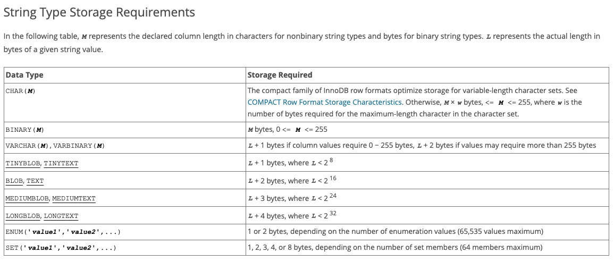
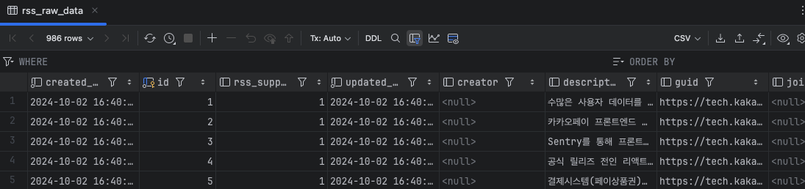

rss 피드 데이터를 가져오는 과정에서 `https://dev.gmarket.com/rss` 사이트에서 제공해주는 `description` 데이터 크기가 상당히 큰 것으로 확인되어   
어떤 데이터 타입을 사용해야 할 지에 대해 고민하게 되었습니다.   

<!--more-->

아래는 description 길이에 대한 정보입니다.

```java
descriptionLength : 91831
```

`varchar`로는 큰 데이터를 받을 수 없기 때문에 `text` 타입을 사용하면 큰 데이터도 충분히 받을 수 있을 것이라 예상하였습니다.   
`text` 타입을 사용하여도 큰 데이터를 받을 수 없는 상황이 발생되어 `blob`, `longblob`을 사용하여 큰 데이터를 담는 과정에 대하여 알아보겠습니다.   

그 이전에 `MySQL` 데이터 타입별로 최대 몇 바이트의 데이터를 담을 수 있고, 몇 글자까지 데이터를 담을 수 있는지에 대해 알아보는 과정을 가지도록 하겠습니다.   


## String type size
여기서 중점적을 보아야 할 것은 `varchar`, `text`, `blob`, `longblob` 입니다.   
대부분의 데이터는 `text` 타입으로 해결이 된다고 생각하지만, `text` 타입의 길이는 생각보다 짧은 것을 확인할 수 있습니다.   
1. varchar   
`varchar`는 255 byte까지 사용하는 것을 권장하는 것을 보실 수 있습니다.
2. text   
`text`는 0~65535 byte까지 사용이 가능하고, 즉 65535자까지 가능하다는 의미입니다.
3. blob   
`blob`은 text와 동일하게 65535 byte까지 사용이 가능합니다. 65535자가 넘으면 `text`나 `blob`을 사용할 수 없습니다.  
그렇기 때문에 더 큰 데이터를 담을 수 있는 타입을 사용해야 합니다.   
4. longblob   
`longblob`은 약 43억 byte까지 사용이 가능합니다. 43억자까지 데이터를 담을 수 있습니다.   
그렇기 때문에 약 6만 글자가 넘는 데이터는 longblob을 사용하는 것이 좋을 것이라 생각합니다.   



- - -
### text type
- Java code
```java
public class RssRawData extends TimeTracking {

	// 요약 설명
	@Column(name = "description", columnDefinition = "text") // nullable
	private String description;
}
```
- log
```java
SQL Error: 1406, SQLState: 22001
Data truncation: Data too long for column 'description' at row 1

Caused by: org.hibernate.exception.DataException: could not execute statement [Data truncation: Data too long for column 'description' at row 1] [insert into rss_raw_data (created_at,creator,description,guid,joined_category,published_at,rss_supporting_blog_id,title,updated_at,url) values (?,?,?,?,?,?,?,?,?,?)]
Caused by: com.mysql.cj.jdbc.exceptions.MysqlDataTruncation: Data truncation: Data too long for column 'description' at row 1
```
`text` 타입의 경우 최대 65535 byte. utf8 기준(3바이트 문자)으로 21844 글자까지 저장이 가능합니다.
현재 저장하려는 데이터의 길이가 너무 길기 때문에 db에 저장이 불가능합니다.   
그렇기 때문에 다른 데이터 타입을 사용해야 DB에 저장할 수 있게 됩니다.   
- - -
### blob type
- Java code
```java
public class RssRawData extends TimeTracking {

	// 요약 설명
	@Column(name = "description", columnDefinition = "blob") // nullable
	private String description;
}
```
- log
```java
SQL Error: 1406, SQLState: 22001
Data truncation: Data too long for column 'description' at row 1

Caused by: org.hibernate.exception.DataException: could not execute statement [Data truncation: Data too long for column 'description' at row 1] [insert into rss_raw_data (created_at,creator,description,guid,joined_category,published_at,rss_supporting_blog_id,title,updated_at,url) values (?,?,?,?,?,?,?,?,?,?)]
Caused by: com.mysql.cj.jdbc.exceptions.MysqlDataTruncation: Data truncation: Data too long for column 'description' at row 1
```
`text` type과 마찬가지로 `blob` type도 최대 65535 byte이기 때문에 해당 데이터를 저장할 수 없습니다.   
`text`, `blob` 보다 더 큰 데이터를 담을 수 있는 longblob 사용하면 큰 데이터를 DB에 저장할 수 있게 될 것입니다.   
- - -
### longblob type
- Java code
```java
public class RssRawData extends TimeTracking {

	// 요약 설명
	@Column(name = "description", columnDefinition = "longblob") // nullable
	private String description;
}
```
   
`longblob` type은 최대 43억 byte까지 저장할 수 있기 때문에 6만 글자 길이가 넘는 경우 `longblob`을 이용하여 DB에 저장을 할 수 있게 됩니다.   
`longblob` 사용하여 `description` 약 9만 글자의 데이터를 저장한 것을 확인하실 수 있습니다.   
- - -
## Reference
[MySQL docs - String type size](https://dev.mysql.com/doc/refman/8.4/en/storage-requirements.html)   
[MySQL docs - blob, text](https://dev.mysql.com/doc/refman/8.4/en/blob.html)